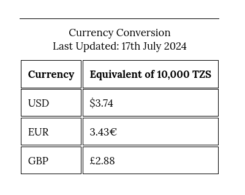

# [SHOWCASETZ](https://d0bledore.github.io/ShowcaseTZ)

## Showcase Tanzania: A Personal Journey
This blog chronicles my unique experience in Tanzania, offering an intimate look at East African life through the eyes of a Swedish traveler invited into a local family. Unlike typical tourist accounts, this narrative provides a blend of personal observations and cultural insights. Key Features:

1. Firsthand experiences in Bagamoyo and Dar es Salaam
2. Insights into Tanzanian history, from its colonial past to present day
3. Insights into visa processes and local transportation
4. Cultural observations comparing European and African lifestyles
5. Personal anecdotes about family interactions and daily life in Tanzania

This blog aims to bridge cultures, fostering understanding and appreciation for Tanzania's heritage while providing valuable information for potential travelers. Whether you're planning an African adventure or simply curious about life in Tanzania, this blog offers a balanced perspective on the country's beauty, challenges, and potential for personal growth. Join me on this transformative journey and explore why Tanzania is not just a destination, but an experience that can broaden your horizons.

source: [amiresponsive](https://ui.dev/amiresponsive?url=https://d0bledore.github.io/ShowcaseTZ)

## UX

My design process for Showcase Tanzania was guided by a clear vision and user-centric approach:

### Conceptualization
- The project began with a focus on Tanzania, evolving into a personal narrative that offers unique insights into the country.

### Visual Identity
- Created a striking landing page with a logo and a background that immediately communicates the Tanzanian theme to visitors.

### Readability and Structure
- Implemented responsive design with margins for wider screens (768px+) to enhance readability.
- Used hr-elements to structure text sections, encouraging readers to progress through the content.
- Incorporated pictures and videos to boost engagement and break up text.

### Content Strategy
- Balanced personal storytelling with informative content about Tanzania, using visuals to reinforce key points and maintain reader interest.

### Navigation
- Designed an intuitive navigation system allowing users to easily move between topics.
- Included an index button and table of contents for quick access to specific sections.
- Kept individual topics concise for easy re-reading and reference.
- "Call to Action" button ('READ MY BLOG') to encourage immediate engagement with the site's primary content.

### Accessibility
- Added a translate button on the landing page to accommodate non-English speakers, particularly friends and family.

### User Feedback
- Integrated a feedback section, facilitating continuous improvement and potential future expansion of the project.

### Color Scheme

The color palette for Showcase Tanzania was carefully chosen to reflect the essence of Tanzania and create a visually appealing, easy-to-read experience:

#### Tanzanian Flag Inspiration
- The logo incorporates the Tanzanian flag as a background, immediately establishing the national context.
- Landing page buttons mirror the flag's colors:
  - Green on the left
  - Blue on the right
This color choice creates a strong visual connection to Tanzania from the moment visitors enter the site.

#### Warm Accents for Key Sections
- About section: `rgba(255, 180, 0, .25)` (soft golden yellow)
- Index page: `khaki`
These warm hues are used to differentiate non-blog content, creating a welcoming atmosphere and improving navigation.

#### Classic Blog Styling
- Primary text: `#000000` (black)
- Background: White
The main blog content adopts a classic black-and-white scheme, reminiscent of traditional print media. This choice:
  - Enhances readability
  - Creates a timeless, newspaper-like feel
  - Allows images and videos to stand out

This color scheme and design approach creates a simple yet engaging platform to explore Tanzanian culture and personal experiences.

### Typography

In selecting the typography for Showcase Tanzania, I prioritized both aesthetics and readability. After careful consideration, I chose a single, versatile font family:

- **[Lora](https://fonts.google.com/specimen/Lora)**: Used for all text throughout the site

Lora is a well-balanced serif typeface superfamily designed for screen appearance. Lora's design is optimized for body text, ensuring comfortable reading across various screen sizes and resolutions. 

By using a single font family throughout the site, Showcase Tanzania maintains a cohesive visual identity while ensuring optimal readability for users engaging with the personal narratives and informational content about Tanzania.

## User Stories

In this section, list all of your user stories for the project.

### New Site Users

- As a new site user, I would like to ____________, so that I can ____________.
- As a new site user, I would like to ____________, so that I can ____________.
- As a new site user, I would like to ____________, so that I can ____________.
- As a new site user, I would like to ____________, so that I can ____________.
- As a new site user, I would like to ____________, so that I can ____________.

### Returning Site Users

- As a returning site user, I would like to ____________, so that I can ____________.
- As a returning site user, I would like to ____________, so that I can ____________.
- As a returning site user, I would like to ____________, so that I can ____________.
- As a returning site user, I would like to ____________, so that I can ____________.
- As a returning site user, I would like to ____________, so that I can ____________.

## Features

### Navigation

The website features a user-friendly navigation bar fixed at the bottom of the screen, providing easy access to key sections:

- **Home**: The main landing page
- **About**: Serves as a personal foreword to the blog and the blog's role as a project
- **Index**: A comprehensive list of content that also serves as a navigation tool. Each list item is clickable, allowing users to easily jump to specific sections within the blog.
- **Contact**: A contact form to submit inquiries

This fixed-bottom navigation ensures that users can quickly move between sections of the site without needing to scroll, enhancing the overall user experience on both desktop and mobile devices.

### Landing Page

The landing page features two prominent buttons that enhance user engagement and accessibility:

1. **Language Toggle Button**

Dynamically changes based on the current language:

- Labeled "Toleo la Kiswahili" (Swahili Version) on the English site
- Changes to "English Version" on the Swahili site

 
Links to the alternate language version of the site:
- English to Swahili (swahili.html)
- Swahili to English (index.html)

Provides language accessibility, catering to both international and local (Tanzanian) audiences.

2. **Call to Action (CTA) Button**

- Prominently displays "READ MY BLOG"
- Directs users to the main blog content section
- Encourages immediate engagement with the site's primary content

### About Section

This "About" section encapsulates the multi-faceted nature of my project, highlighting its personal significance, educational value, and broader cultural impact. It also acknowledges my audience and the project's role in my professional development.

By placing it in the navigation bar, I ensure it's easily accessible for visitors who might want to learn more about the blog's origins and goals, even if they dive straight into the content via the call-to-action. This way, readers can find important background information without disrupting their main reading experience. 

### Index Page

The Index page serves as a dynamic content directory and navigation hub:

- Offers a comprehensive, clickable list of all blog content
- Functions as an interactive navigation tool, complementing the main navigation bar
- Enables quick access to specific blog sections
- Enhances site usability by providing an alternative way to explore content
- Accessible from any page via the navigation bar, facilitating easy blog navigation

This feature streamlines the user experience, allowing visitors to efficiently find and access desired content throughout the blog.

### Feedback Form

The website includes a user-friendly feedback form that allows visitors to share their thoughts directly with me:

- Requires essential information: Name, Email, and Feedback
- Clearly marks required fields with asterisks (*)
- Includes a textarea for detailed feedback
- Features a prominent "Send" button for submission
- Utilizes form validation to ensure all required fields are filled
- Accessible via the navigation bar, allowing easy feedback from any page

This feature enhances user engagement by providing a straightforward way for readers to share their thoughts, ask questions, or provide feedback about the blog content. It reflects the personal nature of the blog and encourages a direct connection between the readers and myself as the author.

### Blog Features

1. **Firsthand Experiences in Bagamoyo and Dar es Salaam**
   - Reflection on Bagamoyo's historical significance
   - Impressions of Dar es Salaam
   - Descriptions of the vibrant fish market in Bagamoyo
   - Experience with local transportation, including "boda boda" motorcycle taxis

2. **Insights into Tanzanian History**
   - Information about Bagamoyo's role in the slave trade and as the first capital of German East Africa
   - Observations on the remnants of colonial architecture, such as the old German Boma

3. **Practical Travel Tips**
   - Details on the "visa on arrival" process
   - Statistics into the economy and GDP of Tanzania for understanding local prices
   - Currency conversion table

 

4. **Cultural Observations**
   - Reflections on the sense of community and welcoming attitude towards foreigners
   - Comparisons of attitudes towards tourists in Tanzania versus Europe
   - Personal anecdotes about family interactions and daily life in Tanzania

5. **Multimedia Integration**
   - Videos and images next to the text create a pleasant reading experience

- **Examples:**

## Future Features

### Functional Feedback System

- **Current Status**: The feedback form currently dumps data to "https://formdump.codeinstitute.net".
- **Planned Improvement**: Implement a system to directly receive and process user feedback.
- **Benefit**: Enable real-time engagement with readers and continuous improvement of content.

### Update About Section

As the content and quality of the site evolve, the About section will need to grow correspondingly (and on a seperate page). I plan to expand and refine this section to provide a more comprehensive overview of the project's development, goals, and impact. This ongoing update will ensure that visitors always have access to the most current and relevant information about Showcase Tanzania, reflecting its growth and increasing value as a resource.

### Comprehensive Tourist Guide and Local Services

- **Expansion Plan**: Add a dedicated section for both popular and off-the-beaten-path attractions in Tanzania.
- **Content**: 
  - Detailed information about attractions and experiences
  - Practical visitor tips and high-quality visuals
  - Curated list of accommodations suitable for various budgets
  - Suggested travel itineraries for different types of travelers
  - Contact information for reputable local guides and services
- **Integration**: Seamlessly incorporate this new section using the existing navigation structure.
- **Objective**: Provide easy access to valuable information for potential travelers, enhancing their planning and overall experience in Tanzania.
- **Impact**: Offer a more comprehensive resource for visitors while indirectly supporting local tourism through informed travel choices.

#### Enhanced Showcasing of Tanzania

This expanded guide will transform Showcase Tanzania from a personal narrative into a valuable resource for all Tanzania-bound travelers. By offering detailed, firsthand information on attractions, accommodations, and local services, the blog will become an essential tool for trip planning, helping visitors discover the best of Tanzania while supporting local communities through informed tourism.

##### Expanded Geographic Coverage
- **Current Focus**: Bagamoyo and Dar Es Salaam
- **Future Additions**:
  - Indian Ocean Islands (Zanzibar, Mafia Island, etc.)
  - Private island getaways
  - Inland attractions and national parks

##### Safari Experiences
- **Highlight**: Tanzania's world-renowned safari opportunities
- **Content**: Detailed guides, best practices, and personal experiences
- **Focus**: Ethical and sustainable wildlife tourism

##### Kilimanjaro Adventures
- **Feature**: Comprehensive guide to climbing Africa's highest peak
- **Include**: Preparation tips, route information, and personal accounts

### Long-term Vision

As Showcase Tanzania grows, it has the potential to become much more than a personal blog. By expanding its content and features, the site could transform into a comprehensive travel resource for Tanzania, offering in-depth information, practical tips, and unique insights that go beyond typical tourist guides. This evolution could open doors to freelance opportunities in travel writing and consulting, allowing me to share my expertise with a wider audience and potentially turn my passion into a profession.

Furthermore, as the site gains recognition, I might have the chance to develop partnerships with local tourism boards and tour operators in Tanzania. These collaborations could not only enhance the quality and depth of information on my site but also contribute to promoting tourism practices in the country. By highlighting travel options and supporting local communities, Showcase Tanzania could play a role in fostering a more sustainable approach to tourism in Tanzania, benefiting both visitors and local residents alike.

## Tools & Technologies Used

In this section, you should explain the various tools and technologies used to develop the project.
Make sure to put a link (where applicable) to the source, and explain what each was used for.
Some examples have been provided, but this is just a sample only, your project might've used others.
Feel free to delete any unused items below as necessary.

-  used to generate README and TESTING templates.
-  used for version control. (`git add`, `git commit`, `git push`)
-  used for secure online code storage.
-  used as my local IDE for development.
-  used for the main site content.
-  used for the main site design and layout.
-  used for hosting the deployed front-end site.
-  used to help write and translate text content. 
- [Perplexity Ai](https://www.perplexity.ai/) used to help write, translate text content and troubleshoot code after validation. 

## Testing

> [!NOTE]  
> For all testing, please refer to the [TESTING.md](TESTING.md) file.

## Deployment

The site was deployed to GitHub Pages. The steps to deploy are as follows:

In the [GitHub repository](https://github.com/D0bledore/ShowcaseTZ), navigate to the Settings tab 
- From the source section drop-down menu, select the **Main** Branch, then click "Save".
- The page will be automatically refreshed with a detailed ribbon display to indicate the successful deployment.

The live link can be found [here](https://d0bledore.github.io/ShowcaseTZ)

### Local Deployment

This project can be cloned or forked in order to make a local copy on your own system.

#### Cloning

You can clone the repository by following these steps:

1. Go to the [GitHub repository](https://github.com/D0bledore/ShowcaseTZ) 
2. Locate the Code button above the list of files and click it 
3. Select if you prefer to clone using HTTPS, SSH, or GitHub CLI and click the copy button to copy the URL to your clipboard
4. Open Git Bash or Terminal
5. Change the current working directory to the one where you want the cloned directory
6. In your IDE Terminal, type the following command to clone my repository:
	- `git clone https://github.com/D0bledore/ShowcaseTZ.git`
7. Press Enter to create your local clone.

Alternatively, if using Gitpod, you can click below to create your own workspace using this repository.

Please note that in order to directly open the project in Gitpod, you need to have the browser extension installed.
A tutorial on how to do that can be found [here](https://www.gitpod.io/docs/configure/user-settings/browser-extension).

#### Forking

By forking the GitHub Repository, we make a copy of the original repository on our GitHub account to view and/or make changes without affecting the original owner's repository.
You can fork this repository by using the following steps:

1. Log in to GitHub and locate the [GitHub Repository](https://github.com/D0bledore/ShowcaseTZ)
2. At the top of the Repository (not top of page) just above the "Settings" Button on the menu, locate the "Fork" Button.
3. Once clicked, you should now have a copy of the original repository in your own GitHub account!

### Local VS Deployment

There is no difference between the local version and the deployed version on github pages. 

## Credits

In this section I layout all the extra help I got. 

### Content

| Source | Location | Notes |
| --- | --- | --- |
| [Markdown Builder](https://tim.2bn.dev/markdown-builder) | README and TESTING | tool to help generate the Markdown files |

|[CodePen User thebabydino](https://codepen.io/thebabydino/details/zvKxeL) | CSS Stylesheet 'background flag of Logo' |  |
|[W3Schools](https://www.w3schools.com/html/html5_video.asp) | index.html | tutorial on HTML Video tag |
|[W3Schools](https://www.w3schools.com/css/css_background_image.asp)| styles.css | tutorial on CSS Background Image |
|[W3Schools](https://www.w3schools.com/css/css_navbar.asp)| index.html & styles.css | tutorial on CSS Navigation Bar |
|[W3Schools](https://www.w3schools.com/css/css_display_visibility.asp) | styles.css | tutorial on CSS Layout - The display property | 
|[Chat GPT](chat.openai.com)| index.html | used for generating text content from orignal to enhanced version | 
|[Chat GPT](chat.openai.com)| swahili.html | used for translation from english to swahili | 
|[Perplexity Ai](https://www.perplexity.ai)| swahili.html | used for translation from english to swahili |
|[Perplexity Ai](https://www.perplexity.ai)| swahili.html | used for generating text content from original to enhanced version |
|Rose Kilima (girlfriend)| swahili.html | checked translated swahili version |  
|[Mentor Tim](https://github.com/TravelTimN) | index.html & styles.css | major assisstance in troubleshooting code, especially positioning of header | 

### Image Attribution

**All images** were taken by me, **except** for these three, which are Public Domain: 

| Source | Location | Type | Notes |
| --- | --- | --- | --- |
| [CIA Factbook](https://www.cia.gov/the-world-factbook/about/archives/2021/static/e7a4b1bee67e722e085a8fa65d4ea15c/90944/TZ-map.jpg) | about Tanzania | image | map of Tanzania |
| [Wikipedia](https://upload.wikimedia.org/wikipedia/commons/5/55/TZSn01000v.jpg) | about Tanzania | image | 1000 Tanzania Shilling Front |
| [Wikipedia](https://upload.wikimedia.org/wikipedia/commons/3/38/Flag_of_Tanzania.svg) | entire site | image | favicon on both pages |

### Acknowledgements

My special thanks go to my partner (Rose Kilima), for believing in me. She is also the reason I found Code Institute and applied for the Full-Stack Software Development Course. 