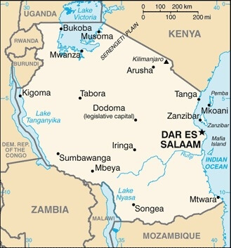

# [SHOWCASETZ](https://d0bledore.github.io/ShowcaseTZ)

## Showcase Tanzania: A Personal Journey
This blog chronicles my unique experience in Tanzania, offering an intimate look at East African life through the eyes of a Swedish traveler invited into a local family. Unlike typical tourist accounts, this narrative provides a blend of personal observations and cultural insights. Key Features:

1. Firsthand experiences in Bagamoyo and Dar es Salaam
2. Insights into Tanzanian history, from its colonial past to present day
3. Insights into visa processes and local transportation
4. Cultural observations comparing European and African lifestyles
5. Personal anecdotes about family interactions and daily life in Tanzania

This blog aims to bridge cultures, fostering understanding and appreciation for Tanzania's heritage while providing valuable information for potential travelers. Whether you're planning an African adventure or simply curious about life in Tanzania, this blog offers a balanced perspective on the country's beauty, challenges, and potential for personal growth. Join me on this transformative journey and explore why Tanzania is not just a destination, but an experience that can broaden your horizons.

source: [amiresponsive](https://ui.dev/amiresponsive?url=https://d0bledore.github.io/ShowcaseTZ)

## Features

### Navigation

The website features a user-friendly navigation bar fixed at the bottom of the screen, providing easy access to key sections:

- **Home**: The main landing page
- **About**: Serves as a personal foreword to the blog and the blog's role as a project
- **Index**: A comprehensive list of content that also serves as a navigation tool. Each list item is clickable, allowing users to easily jump to specific sections within the blog.
- **Contact**: A contact form to submit inquiries

This fixed-bottom navigation ensures that users can quickly move between sections of the site without needing to scroll, enhancing the overall user experience on both desktop and mobile devices.

### Landing Page

The landing page features two prominent buttons that enhance user engagement and accessibility:

1. **Language Toggle Button**

Dynamically changes based on the current language:

- Labeled "Toleo la Kiswahili" (Swahili Version) on the English site
- Changes to "English Version" on the Swahili site
 
Links to the alternate language version of the site:
- English to Swahili (swahili.html)
- Swahili to English (index.html)

Provides language accessibility, catering to both international and local (Tanzanian) audiences.

2. **Call to Action (CTA) Button**
- Prominently displays "READ MY BLOG"
- Directs users to the main blog content section
- Encourages immediate engagement with the site's primary content

### Index Page

The Index page serves as a dynamic content directory and navigation hub:

- Offers a comprehensive, clickable list of all blog content
- Functions as an interactive navigation tool, complementing the main navigation bar
- Enables quick access to specific blog sections
- Enhances site usability by providing an alternative way to explore content
- Accessible from any page via the navigation bar, facilitating easy blog navigation

This feature streamlines the user experience, allowing visitors to efficiently find and access desired content throughout the blog.

### Feedback Form

The website includes a user-friendly feedback form that allows visitors to share their thoughts directly with me:

- Requires essential information: Name, Email, and Feedback
- Clearly marks required fields with asterisks (*)
- Includes a textarea for detailed feedback
- Features a prominent "Send" button for submission
- Utilizes form validation to ensure all required fields are filled
- Submits data to a secure endpoint (https://formdump.codeinstitute.net/)
- Accessible via the navigation bar, allowing easy feedback from any page

This feature enhances user engagement by providing a straightforward way for readers to share their thoughts, ask questions, or provide feedback about the blog content. It reflects the personal nature of the blog and encourages a direct connection between the readers and myself as the author.

### Blog Features

1. **Firsthand Experiences in Bagamoyo and Dar es Salaam**
   - Reflection on Bagamoyo's historical significance
   - Impressions of Dar es Salaam
   - Descriptions of the vibrant fish market in Bagamoyo
   - Experience with local transportation, including "boda boda" motorcycle taxis

2. **Insights into Tanzanian History**
   - Information about Bagamoyo's role in the slave trade and as the first capital of German East Africa
   - Observations on the remnants of colonial architecture, such as the old German Boma

3. **Practical Travel Tips**
   - Details on the "visa on arrival" process
   - Statistics into the economy and GDP of Tanzania for understanding local prices
   - Currency conversion table

 

4. **Cultural Observations**
   - Reflections on the sense of community and welcoming attitude towards foreigners
   - Comparisons of attitudes towards tourists in Tanzania versus Europe
   - Personal anecdotes about family interactions and daily life in Tanzania

5. **Multimedia Integration**
   - Videos and images next to the text create a pleasant reading experience

- **Examples:**

## Tools & Technologies Used

-  used to generate README and TESTING templates.
-  used for version control. (`git add`, `git commit`, `git push`)
-  used for secure online code storage.
-  used as my local IDE for development.
-  used for the main site content.
-  used for the main site design and layout.
-  used for hosting the deployed front-end site.
-  used to help write and correct text content. 

## Deployment

The site was deployed to GitHub Pages. The steps to deploy are as follows:

In the [GitHub repository](https://github.com/D0bledore/ShowcaseTZ), navigate to the Settings tab 
- From the source section drop-down menu, select the **Main** Branch, then click "Save".
- The page will be automatically refreshed with a detailed ribbon display to indicate the successful deployment.

The live link can be found [here](https://d0bledore.github.io/ShowcaseTZ)

### Local Deployment

This project can be cloned or forked in order to make a local copy on your own system.

#### Cloning

You can clone the repository by following these steps:

1. Go to the [GitHub repository](https://github.com/D0bledore/ShowcaseTZ) 
2. Locate the Code button above the list of files and click it 
3. Select if you prefer to clone using HTTPS, SSH, or GitHub CLI and click the copy button to copy the URL to your clipboard
4. Open Git Bash or Terminal
5. Change the current working directory to the one where you want the cloned directory
6. In your IDE Terminal, type the following command to clone my repository:
	- `git clone https://github.com/D0bledore/ShowcaseTZ.git`
7. Press Enter to create your local clone.

Alternatively, if using Gitpod, you can click below to create your own workspace using this repository.

Please note that in order to directly open the project in Gitpod, you need to have the browser extension installed.
A tutorial on how to do that can be found [here](https://www.gitpod.io/docs/configure/user-settings/browser-extension).

#### Forking

By forking the GitHub Repository, we make a copy of the original repository on our GitHub account to view and/or make changes without affecting the original owner's repository.
You can fork this repository by using the following steps:

1. Log in to GitHub and locate the [GitHub Repository](https://github.com/D0bledore/ShowcaseTZ)
2. At the top of the Repository (not top of page) just above the "Settings" Button on the menu, locate the "Fork" Button.
3. Once clicked, you should now have a copy of the original repository in your own GitHub account!

## Credits

### Image Attribution

All images were taken by me, except for these three, which are Public Domain: 

- **Description:** 1000 Tanzania Shilling Front.
- **Date:** 2 July 2017, 10:07:15
- **License:** This file is made available under the [Creative Commons CC0 1.0 Universal Public Domain Dedication](https://creativecommons.org/publicdomain/zero/1.0/deed.en)
- **Source:** [Link to Original Image](https://upload.wikimedia.org/wikipedia/commons/5/55/TZSn01000v.jpg)
 

- **Description:** Map of Tanzania
- **License:** CIA Factbook images and photos — obtained from a variety of sources — are in the public domain and are copyright free.
- **Source:** [Link to Original Image](https://www.cia.gov/the-world-factbook/about/archives/2021/static/e7a4b1bee67e722e085a8fa65d4ea15c/90944/TZ-map.jpg)

**Used for Favicons** 

- **Description:** Flag of Tanzania
- **License:** This work is ineligible for copyright and therefore in the public domain because it consists entirely of information that is common property and contains no original authorship. 
- **Source:** [Link to Original Image](https://upload.wikimedia.org/wikipedia/commons/3/38/Flag_of_Tanzania.svg)

### Content

| Source | Location | Notes |
| --- | --- | --- |
| [Markdown Builder](https://tim.2bn.dev/markdown-builder) | README and TESTING | tool to help generate the Markdown files |

|CodePen User thebabydino (https://codepen.io/thebabydino/details/zvKxeL) | Flag of Tanzania (pure CSS) | 
    background:
        linear-gradient(to right bottom,
            #1eb53a 38%, #fcd116 0, #fcd116 42%, #000 0,
            #000 58%, #fcd116 0, #fcd116 62%, #00a3dd 0);