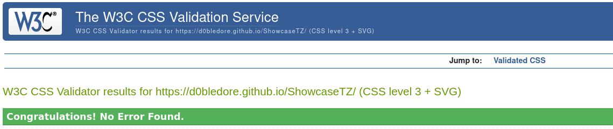
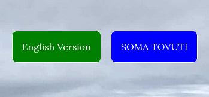
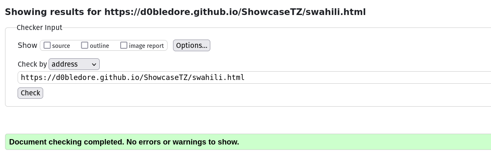

# Testing

> [!NOTE]  
> Return back to the [README.md](README.md) file.

## Code Validation

### HTML

I have used the recommended [html W3C Validator](https://validator.w3.org) to validate all of my html files.

| Directory | File | Screenshot | Notes |
| --- | --- | --- | --- |
|  | index.html |  | no error found |
|  | swahili.html |  | no error found |

HTML Validation Links:

- **Index.html:** https://validator.w3.org/nu/?doc=https%3A%2F%2Fd0bledore.github.io%2FShowcaseTZ%2Findex.html
- **swahili.html:** https://validator.w3.org/nu/?doc=https%3A%2F%2Fd0bledore.github.io%2FShowcaseTZ%2Fswahili.html

### CSS

I have used the recommended [CSS Jigsaw Validator](https://jigsaw.w3.org/css-validator) to validate all of my CSS files.

| Directory | File | Screenshot | Notes |
| --- | --- | --- | --- |
| assets/css | styles.css |  | no error found |

CSS Validation Link:

- **styles.css:** https://jigsaw.w3.org/css-validator/validator?uri=https%3A%2F%2Fd0bledore.github.io%2FShowcaseTZ

## Browser Compatibility

I tested the live/deployed version of my site on the following browsers: 

- [Ungoogled Chrome](https://www.techspot.com/downloads/7181-ungoogled-chromium.html)
- [Firefox](https://www.mozilla.org/firefox/download/)
- [Brave](https://brave.com/download)
- [Opera](https://www.opera.com/download)

I've tested my deployed project on multiple browsers to check for compatibility issues.

| Browser | Home | About | Index | Feedback | Notes |
| --- | --- | --- | --- | --- | --- |
| Ungoogled Chromium |  |  |  |  | Works as expected |
| Firefox |  |  |  |  | Works as expected |
| Brave |  |  |  |  | Works as expected |
| Opera |  |  |  |  | Works as expected |

## Responsiveness

I've tested my deployed project on multiple devices to check for responsiveness issues.

| Device | Home | About | Index | Feedback | Notes |
| --- | --- | --- | --- | --- | --- |
| Mobile (DevTools) |  |  |  |  | Works as expected |
| Tablet (DevTools) |  |  |  |  | Works as expected |
| Desktop |  |  |  |  | Works as expected |

## Lighthouse Audit

I've tested my deployed project using the Lighthouse Audit tool to check for any major issues.

| Page | Mobile | Desktop | Notes |
| --- | --- | --- | --- |
| index.html |  |  | minor performance impact due to resource loading |
| swahili.html |  |  | minor performance impact due to resource loading  | 

## Bugs

### HTML Validation Process and Improvements

As I ran my code through the html validator, I was surprised to discover several deviations from standard practices. However, I view this as a learning opportunity. While I'm not yet an expert, I firmly believe that persistence and continuous improvement are key to developing expertise.

#### Initial Validation Results

-  **Initial validation screenshot** 

 

The validator highlighted three main issues: 

1. **Nested Elements:** The < a > element was incorrectly nested inside a < button > element. To resolve this, I removed the < button > element and styled the < a > elements to resemble buttons. This approach maintained the desired appearance while improving semantics and accessibility. I verified that the buttons on both pages still function as intended.

2. **List Structure:** The list structure was incorrect according to html standards. To fix this, I adjusted the hierarchy by wrapping the < ul > inside an < li > item, rather than having it as a direct child of the < ol >. This correction adheres to proper html structure without affecting the functionality or appearance of the index section.

3. **Paragraph in Table:** A < p > element was incorrectly placed inside a < table > element. I moved it outside and above the table. This change is not visually apparent as browsers like Firefox automatically adjust the rendering to place the paragraph outside the table.

#### Second Round of Validation

- **Second validation screenshot**

 

The second validation revealed two additional points:

1. **Textarea Attribute:** I learned that the < textarea > element should not include a type attribute, as it defaults to text input.
2. **Heading Elements:** To improve accessibility, I added the required heading (< h >) elements as suggested by the validator. These additions can be seen in the comparison table below.

- **Final validation screenshot** 

##### Comparisson Table

| Issue | Before | After | Notes |
| --- | --- | --- | --- |
| Nested < a > inside < button > element |  |  | Improved semantics and accessibility|
| Missing headline |  |  | Improved Accessibility |
| Missing headline |  |  | Improved Accessibility |

#### Swahili Version Validation

- **Swahili validation screenshot**

When validating the Swahili version, I discovered two issues: 

1. A < p > element without any purpose, which I promptly removed.
2. An incorrect language attribute in the < html > element. I updated it to lang="sw" for Swahili, as recommended by the validator.

These adjustments resulted in a successful validation:

- **Swahili validation complete screenshot**

This validation process has been invaluable, significantly enhancing my understanding of html best practices and standards.

## Unfixed Bugs

> [!NOTE]  
> There are no remaining bugs that I am aware of.

